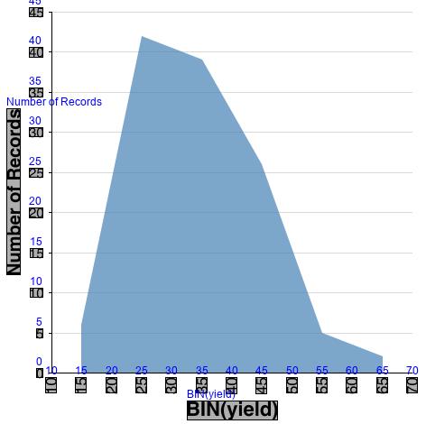

# Reverse-Engineering Visualizations (REV)

REV ([paper](http://idl.cs.washington.edu/papers/reverse-engineering-vis/)) is a text analysis pipeline which detects text elements in a chart, classifies their role (e.g., chart title, x-axis label, y-axis title, etc.), and recovers the text content using optical character recognition. It also uses a Convolutional Neural Network for mark type classification. Using the identified text elements and graphical mark type, it infers the encoding specification of an input chart image.

Our pipeline consist of the following steps:

* Text localization and recognition
* Text role classification
* Mark type classification
* Specification induction

## Installation
You first need to download our code:  
```sh
git clone git@github.com:visual-ds/rev.git
```

After this, execute (you must be inside `rev` folder; run `cd rev`) 
```sh 
ipython setup.ipy 
``` 
to install the (Python) dependencies and darknet. 

Then, download the data and models are in the following
[link](https://drive.google.com/drive/folders/1lXpoi4lwUW3ZZCojq0bHnJTubSmStKhJ).
**Update:** we are now using [OSF](osf.io); the data and the models, which still need to be unziped, are available in this [link](https://osf.io/wubdr/). 
You have to unzip the files in the project folder.

### Dependencies
* You can use any package manager to install the basic dependencies, we suggest creating an environment in conda:

```sh
    conda env create -f env.yml
```
> Note: If when calling the `classify` method of the `MarkClassifier` class
>1. You get the following error:
>```sh
> TypeError _open() got an unexpected keyword argument 'as_grey'
>```
> replace line 296 in the `[your_library_path]/caffe/io.py` file:
>````Python
>img = skimage.img_as_float(skimage.io.imread(filename, as_grey=not color)).astype(np.float32)
>````
> by:
> ````Python
>img = skimage.img_as_float(skimage.io.imread(filename, as_gray=not color)).astype(np.float32)
>    ````
>2. You get the following error:
>```sh
>TypeError: 'float' object cannot be interpreted as an integer
>```
> replace line 95 of the `[your_library_path]/caffe/classifier.py` file :
>````Python
>predictions = predictions.reshape((len(predictions) / 10, 10, -1))
>````
>by:
>````Python
>predictions = predictions.reshape((len(predictions) // 10, 10, -1))
>````

* Darknet

    For text mask detection we use a modified version of Darknet, available in our fork ([visual-ds/darknet](https://github.com/visual-ds/darknet))
    - First, you have to clone the repository and make command:

        ```sh
            git clone git@github.com:visual-ds/darknet.git
            cd darknet
            make
        ```

    - Then, set the path to the darknet executable in the `config.json` file:

        ```js
            "darknet_lib_path": "[replace_with_your_darknet_folder_path]./darknet"
        ```


## Using our API

### Basic Chart usage

Our API works with objects of the class `Chart`. A chart is composed of an image ( visualization) and the text elements (texts, text boxes, and text roles).


In this example, we use the image `examples/image.png` and a CSV file that contains the information of the text elements `examples/image-texts.csv` with the following format:

```CSV
id,x,y,width,height,text,type
1,30,5,19,17,"45",y-axis-label
...
```


```python
from rev.chart import Chart

chart = Chart('examples/image.png', text_from=0)
```

<!---
The parameter `text_from` means:
- **0**: read information from ground truth data: **'{image_name}-texts.csv'**
- **1**: read information from ground truth boxes and output of text role classification and output of OCR: **'{image_name}-pred1-texts.csv'**
- **2**: read information from output of text localization and output of text role classification, and output of OCR. : **'{image_name}-pred2-texts.csv'**
!--->

The parameter 'text_from' means:
- **0**: read ground truth data:
    - '{image_name}-texts.csv'
    - '{image_name}-mask.png'
    - '{image_name}-debug.png'  


- **1**: read text from 'pred1', i.e., ground truth boxes and output of text role classification and output of OCR:
    - '{image_name}-pred1-texts.csv'
    - '{image_name}-pred1-mask.png'
    - '{image_name}-pred1-debug.png'


- **2**: read text from 'pred2', i.e., output of text localization and output of text role classification, and output of OCR:
    - '{image_name}-pred2-texts.csv'
    - '{image_name}-pred2-mask.png'
    - '{image_name}-pred2-debug.png'


> In some cases, it is possible we do not have access to the information of the text elements, so we can infer them using our pipeline.
Also, we can write the information files using the methods of the `Chart` class:
````Python
    # Create a new chart
    chart = Chart('examples/image.png', text_from=2)

    # Infer the text boxes information
    inferred_text_boxes = ... #(we will explain each step of the pipeline further)

    # Set the inferred text boxes to the chart
    chart.text_boxes = inferred_text_boxes

    # Save the file with the information
    chart.save_text_boxes()
````

> In this example, the `text_from=2` parameter indicates that even though the `examples/image-pred2-texts.csv` file does not yet exist, all the information will be saved in a new file with that name.

### Text localization and recognition

For text localization and recognition we must first create an object of the class `TextLocalizer`


```python
from rev.text.localizer import TextLocalizer

localizer = TextLocalizer(method='default')
```

When we instantiate an object of the `TextLocalizer` class, it is possible to choose the method we will use with the `method` parameter, which allows us to choose between three methods:

- **default**: uses the same technique proposed in this paper.
- **pixel_link**: uses the technique presented in en ['PixelLink: Detecting Scene Text via Instance Segmentation'](https://arxiv.org/abs/1801.01315).
- **craft**: uses the technique presented in [CRAFT: Character-Region Awareness For Text detection](https://arxiv.org/abs/1904.01941).

For CRAFT, in particular, we need to load the pretrained model; it is available [here](https://drive.google.com/open?id=1Jk4eGD7crsqCCg9C9VjCLkMN3ze8kutZ). With the pth file in hand, use the `craft_model` argument on the instantiation of `TextLocalizer` class. For instance, 

```python
localizer = TextLocalizer(method = "craft",   
  craft_model = "/path/to/model.pth")
```

Also, we can choose, at this moment, the method for the text recognition: Tesseract or Attn. For Attn, in particular, we need additional (hyper)parameters; specifically, the path to the trained model, which is available (currently) at this [repository](https://github.com/clovaai/deep-text-recognition-benchmark), and other idiosyncratic aspects of the model, which are described in the documentation. The next snippet, then, represents its usage. 

```python  
localizer = TextLocalizer(ocr = "deep_ocr", 
	deep_ocr_params = {"saved_model": "path/to/model"} 
``` 

Then we use the `localize` method that receives a list of charts as input and returns the text boxes and text for each chart in the list. 

```python
all_text_boxes = localizer.localize([chart]) 
```

As in this example, we only use one chart, we will take the first element of the returned list, which contains the text boxes and texts of our chart.


```python
chart_text_boxes = all_text_boxes[0]
for text_box in chart_text_boxes:
    print(text_box)
```

Finally, we create a copy of the original chart to which we assign the text boxes and save a new file with the calculated information (`examples/image-pred2-texts.csv`).


```python
new_chart = chart.copy(text_from=2)
new_chart.text_boxes = chart_text_boxes
new_chart.save_text_boxes()
```

We also save an image where we can visualize the results at this stage of the pipeline (`examples/image-pred2-debug.png`).


```python
new_chart.save_debug_image()
```



### Text role classification

For the text role classification task, we need to instantiate an object of the `TextClassifier` class and use the `classify` method that receives as input a list of charts and returns the labels with the text roles for each chart.


```python
from rev.text import TextClassifier

text_clf = TextClassifier('default')
all_text_type_preds = text_clf.classify([chart])

text_type_preds = all_text_type_preds[0]

for text_box, type_rol in zip(chart.text_boxes , text_type_preds):
    print(text_box.text,':',type_rol)
```

#### Feature extraction

We provide the `feature_extractor.from_chart` function for extracting features from a chart, and you can build your feature file for training from new charts.


```python
from rev.text import feature_extractor
text_features = feature_extractor.from_chart(chart)
text_features
```

#### Training text role classifier


It is possible to train our model to classify text roles. To achieve this, we need a CSV file containing the features for each textbox in the image and the type label (role) that we will use for the training. Check the file `data/features_all.csv` for an example.


```python
import pandas as pd
data = pd.read_csv('data/features_all.csv')
data.head()
```

- First, we choose the features from our dataset that we will use in training, in this case, we provide the list with the features used in the paper: `rev.text.classifier.VALID_COLUMNS`.

- Then we take the `type` column as the text role labels to be used in training.


```python
import rev.text
features = data[rev.text.classifier.VALID_COLUMNS]
types = data['type']
```

- Finally, we created an instance of the `TextClassifier` class and used the `train` method that receives as parameters the features and labels that will be used in training.


```python
text_clf = TextClassifier()
text_clf.train(features, types)
```

### Mark type classifier

The `MarkClassifier` class is used to classify the type of mark on the chart. Currently, our API has two different trained models.

- **charts5cats**

    Model trained with the following five categories:
    - area
    - bar
    - line
    - plotting_symbol
    - undefined.


- **revision**

    Model trained with the following ten categories, using the data presented in the paper [ReVision: Automated Classification, Analysis and Redesign of Chart Images](http://vis.stanford.edu/papers/revision):
    - AreaGraph
    - BarGraph
    - LineGraph
    - Map
    - ParetoChart
    - PieChart
    - RadarPlot
    - ScatterGraph
    - Table
    - VennDiagram

The `classify` method also receives a list of charts and returns a list with the predicted marks for each chart.


```python
from rev.mark import MarkClassifier

mark_clf = MarkClassifier(model_name = 'charts5cats')
print(mark_clf.classify([chart]))
```

### Specification induction

The last step in our pipeline is the generation of the specification. The class `SpecGenerator` performs this task. To generate the specification (visual encoding) of a chart, it is only necessary to use the `generate` method that works with a list of charts and returns another list with the specifications for each chart.


```python
from IPython.display import JSON
from rev.spec.generator import SpecGenerator
import json

chart = Chart('examples/vega1.png', text_from=0)

spec_gen = SpecGenerator()
spec = spec_gen.generate([chart])
JSON(spec[0], expanded=True)
```

### The complete pipeline

Here is an example of how to use the API to generate the specification from a chart image from scratch and without any other information.


```python
from IPython.display import JSON
from rev.spec.generator import SpecGenerator
import json

from rev.chart import Chart
from rev.text.localizer import TextLocalizer
from rev.text import TextClassifier

# Load a chart
chart = Chart('examples/image.png')

# Text localization and recognition:
localizer = TextLocalizer()

# set textbox information
text_boxes = localizer.localize([chart])
chart.text_boxes = text_boxes[0]

# Getting the roles for each textbox
text_clf = TextClassifier('default')
text_type_preds = text_clf.classify([chart])

# Set the role for each textbox on the chart
for (text_box, role) in zip(chart.text_boxes, text_type_preds[0]):
    text_box.type = role

# Generamos la especificación (este método internamente también obtiene el tipo marca del chart)
spec_gen = SpecGenerator()
spec = spec_gen.generate([chart])
JSON(spec[0], expanded=True)
```

## Scripts
Some usefull script to reproduce results from paper:
````shell
# run text localization and recognition in multiple charts
python scripts/run_box_predictor.py multiple ./data/academic.txt
python scripts/run_box_predictor.py multiple ./data/quartz.txt
python scripts/run_box_predictor.py multiple ./data/vega.txt

# script to rate the text localization module
python scripts/rate_box_predictor.py ./data/academic.txt --mask --pad 3 --from_bbs 2
python scripts/rate_box_predictor.py ./data/quartz.txt --mask --pad 3 --from_bbs 2
python scripts/rate_box_predictor.py ./data/vega.txt --mask --pad 3 --from_bbs 2

# script to rate the text-role classifier
python scripts/rate_text_role_classifier.py features ./data/features_academic.csv
python scripts/rate_text_role_classifier.py features ./data/features_quartz.csv
python scripts/rate_text_role_classifier.py features ./data/features_vega.csv

# script to extract features
python scripts/run_feature_extraction.py multiple ./data/academic.txt out.csv

# train text-role classifier
python scripts/run_text_role_classifier.py train ./data/features_all.csv out.plk

# run text-role classifier in a chart to test
python scripts/run_text_role_classifier.py single ./examples/vega1.png

# run text-role classifier in multiple charts
python scripts/run_text_role_classifier.py multiple ./data/academic.txt
````

Also, we have a script for evaluating the text localization implementation of CRAFT, which was inserted in our pipeline. The next snippet illustrates how to use it.

```sh
python scripts/run_craft_box_predictor.py single examples/image.png --model=rev/third_party/craft/weights/craft_mlt_25k.pth
```

(check [CRAFT documentation](https://github.com/clovaai/CRAFT-pytorch) to get the pretrained model).

```python

```
